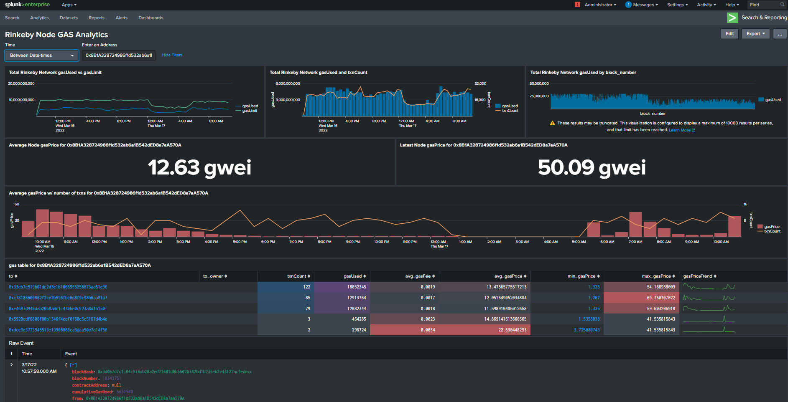
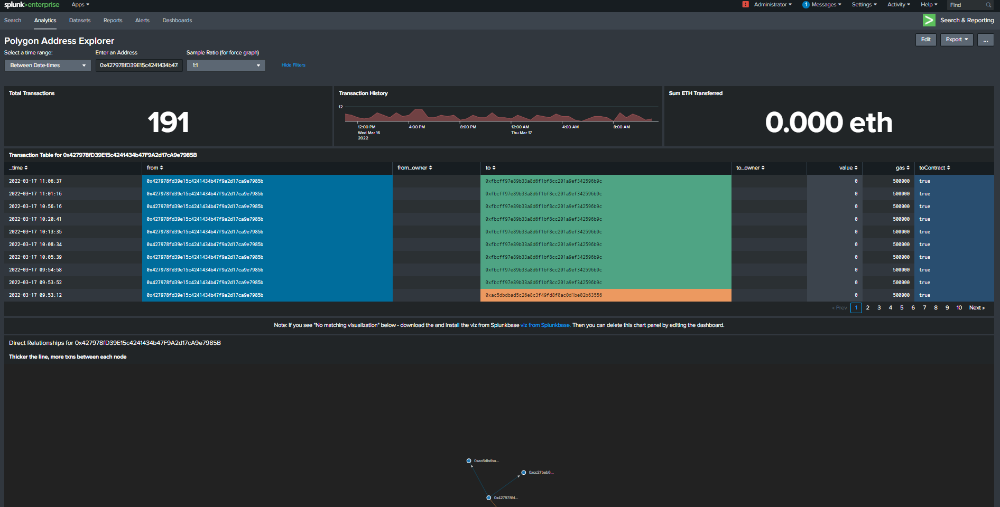

# Monitoring-On-Chain-Full-Node-Data-With-Splunk
This guide covers directly monitoring on-chain block and transactional data from your full nodes in Splunk, as well as how to visualize that data in prebuilt Ethereum dashboards.  This guide builds off of the previous repo [here](https://github.com/maverick705/Splunk-Setup-For-Chainlink) which covers Splunk basic configuration and setup, and also leverages the [Ethlogger](https://github.com/splunk/splunk-connect-for-ethereum) custom connector built by Splunk for this purpose.

**Disclaimer** This is not an official guide by Splunk, but a passionate Chainlink community member.  Splunk is a complex and sophisticated monitoring solution, and it is recommended to have at least some pre-existing knowledge before attempting to deploy this in your own environment.  This guide however will provide the necessary information to get the Ethlogger connector up and running.

## Initial deployment
Please review the pre-existing Ethlogger docs on Github for more information on the connector. Ethlogger can be deployed using Docker with Docker run commands or docker-compose. This guide will leverage the latter.

#### Example Rinkeby Node Gas Analytics Dashboard

#### Example Polygon Address Explorer

